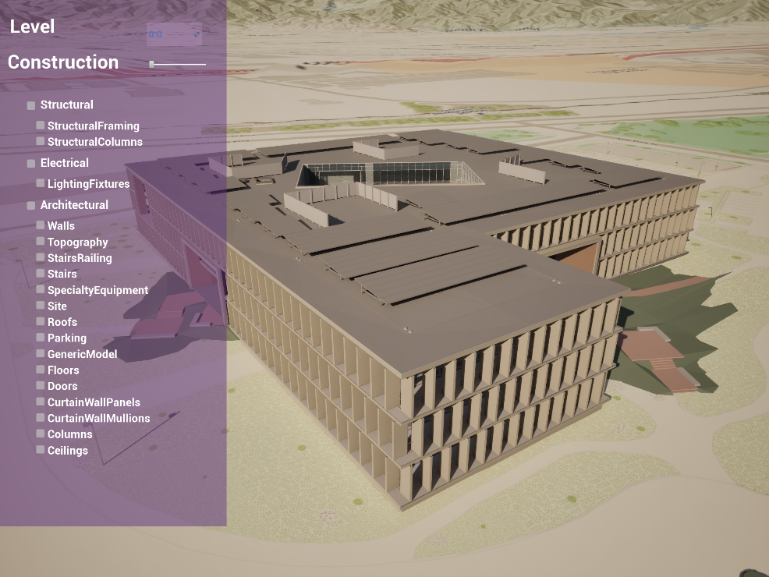
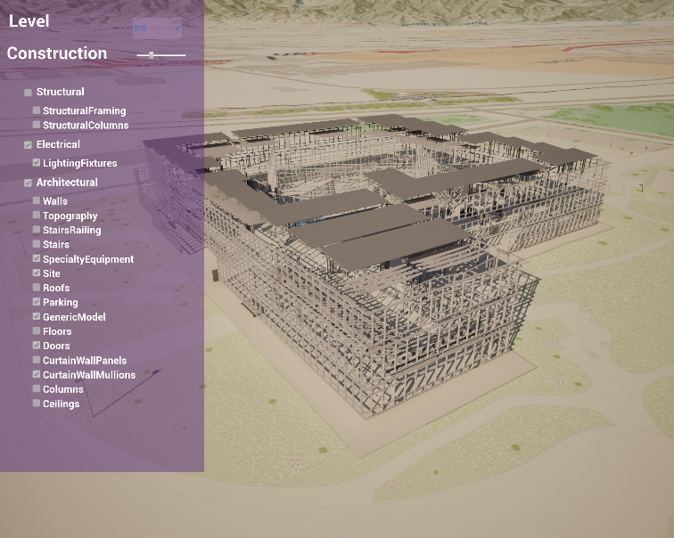

Plugin Requirement: ArcGISSDK for Unreal Engine
Using ArcGIS SDK in Unreal Engine 
1.	BuildingExplorer level: Users can explore the structure of the building by interacting with the menu to toggle visibility of different components such as structural, architectural, and electrical component of a building
+ BuildingSceneLayerActor (C++ class) handle layer initialization, generate building filter query by attribute and toggle layer’s visibility
+ Menu interface (Widget Blueprint) that take the discipline list from the actor class to populate selections

2.	VR Map level: Users can ‘fly’ in the environment navigating with the thumbsticks with movement controller and click on the building with the controllers and get the returned address of the clicked building
+ Geocoding ( C++ class) : handle process geocoding request by location on click by findAddressCandidates | ArcGIS REST APIs
+ VRCharacterController  (Character class): initialize VR origin and camera, set up and execute VR controller input to perform navigation
3.	XRTabletop level: Users can use the thumb stick to adjust the position between the eyes and the table, transform the map by holding the trigger button pointing to the location of the map and use the thumb stick, users can zoom in and out the map by using the thumb stick alone. 
+ BP_Table: the tabletop component and the map component
	+ ArcGIS Map Component attached with ArcGIS’s XR tabletop class to handle map initialization specifically for table top
	+ XR Grabbable (C++ class) : to hold its grabber information 
+ Tabletop Controller initialize VR origin and camera, set up and execute controller iinput
	+ XR_Grabber: attached to the right controller to perform grabbing
4.	FeatureQuery: This level integrates weather query, feature query, recasting, and material update in ArcGIS map 
Retrieving real time weather
+ WeatherQuery: A C++ class to retrieve weather data by location from the weather  REST Service,  https://api.weather.gov, parse the weather data to snow, sunny, cloudy, or rainy .The location however hasn’t been dynamically encoded yet. 
	+ A derived BP_Weather: Get actor location and use the parsed weather data to spawn the appropriate Weather Actor (NS_Rain and Thunder actor using Niagary Particle System) 
		+ BP_Sky: Set the sky’s exposure compensation and rayleigh scattering to create the cloudy, gloomy vs sunny sky effect.
+ Feature Layer: A C++ actor to handle sending and processing feature amenity query (specifically restaurants in NY), then spawn a ArcGIS Pin Actor at that location. 
	+ ArcGIS Pin: An actor contains ArcGIS Location component to handle the location conversion between the UE world coordinate and ArcGIS coordinate system.
   
	+ After all the pins are spawned at all the restaurants location, the level blueprint will perform raycasting from the pin location downward to collect any hit buildings 
	+ Material buffer will be updated to change the material of the restaurant building.
   

