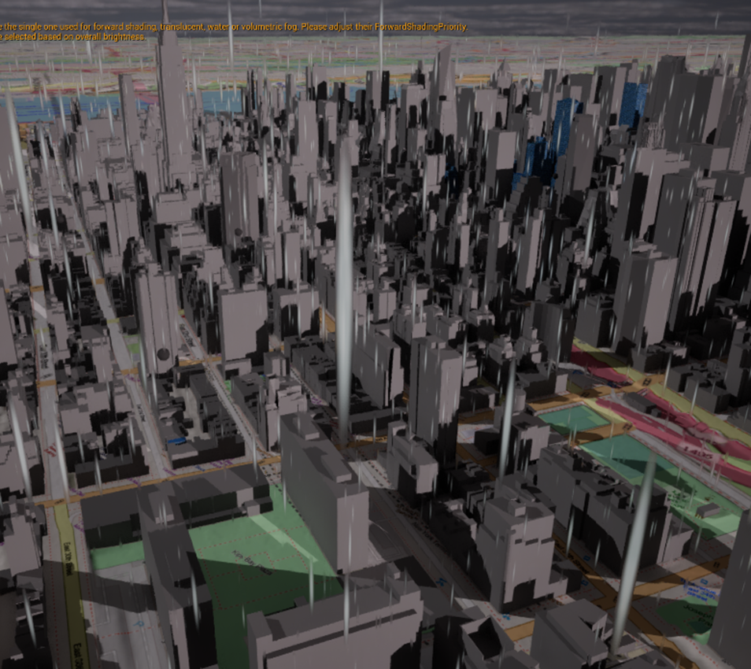

# ArcGIS SDK Integration in Unreal Engine

### Source
This code is built and modified based on [ArcGIS SDK in Unreal Engine sample](https://github.com/Esri/arcgis-maps-sdk-unreal-engine-samples)

## Introduction
This project demonstrates how to integrate the ArcGIS SDK into Unreal Engine, enabling interactive 3D environments with geospatial data. Users can explore buildings, navigate in VR, interact with a tabletop map, and perform feature and weather queries using ArcGIS services.

## Features

### BuildingExplorer Level
Users can explore building structures and interact with the menu to toggle the visibility of different components such as structural, architectural, and electrical elements.

- **`BuildingSceneLayerActor` (C++ Class):** Initializes layers, generates building filter queries based on attributes, and toggles layer visibility.
- **Menu Interface (Widget Blueprint):** Uses the discipline list from `BuildingSceneLayerActor` to populate selection options.

### VR Map Level
Users can navigate the environment using VR controllers, fly around using thumbsticks, and click on buildings to retrieve their addresses.

- **`Geocoding` (C++ Class):** Handles geocoding requests triggered by user clicks, using the ArcGIS REST API’s `findAddressCandidates`.
- **`VRCharacterController` (Character Class):** Initializes the VR origin and camera, and manages VR controller input for navigation.

### XR Tabletop Level
Users can adjust the tabletop map's center, rotation, scaling and transformation with VR controllers.

- **`BP_Table`:** Contains the tabletop and map components.
- **`ArcGIS Map Component`:** Attached to ArcGIS’s XR Tabletop class for map initialization.
- **`XRGrabbable` (C++ Class):** Manages grab interactions.
- **`TabletopController`:** Sets up VR origin, camera, and controller input.
- **`XR_Grabber`:** Attached to the right controller for grabbing the XR Tabletop component.
 
### FeatureQuery Level
This level integrates weather and feature queries, raycasting, and material updates by attribute within the ArcGIS map.

- **`WeatherQuery` (C++ Class):** Retrieves weather data from the [National Weather Service API](https://api.weather.gov), parsing weather conditions (snow, sun, clouds, or rain).
- **`BP_Weather`:** Uses actor location and parsed weather data to spawn appropriate weather effects (e.g., `NS_Rain` and thunder using Niagara Particle System).
- **`BP_Sky`:** An actor with sky exposure and Rayleigh scattering variable to reflect weather conditions.
- **`Feature Layer` (C++ Actor):** Processes feature queries (e.g., restaurants in NY) and spawns `ArcGIS Pin` actors at those locations.
- **`ArcGIS Pin`:** Attached ArcGIS Location component to an Unreal Actor to convert coordinates between Unreal Engine and ArcGIS.
- **Material Updates:** After spawning `ArcGIS Pin` at restaurants' locations, the Feature Level instantiates new material attributes applied to buildings in the 3D Object Scene Layer. 
  
     
## Requirement

Plugin Requirement: 
- ArcGISSDK for Unreal Engine
  Configure API keys for ArcGIS services

For XR and VR development: Oculus and Meta XR enabled in Unreal Engine

## Usage

- **BuildingExplorer:**
  - Run the level.
  - Use the menu to toggle building components.

- **VR Map:**
  - Use VR controllers to fly around.
  - Click buildings to retrieve addresses.

- **XR Tabletop:**
  - Adjust and interact with the tabletop map using VR controls.

- **FeatureQuery:**
  - View real-time weather and feature queries applied to the map.

---
*For detailed API documentation, refer to the [ArcGIS Unreal SDK Documentation](https://developers.arcgis.com/unreal-engine/).*

